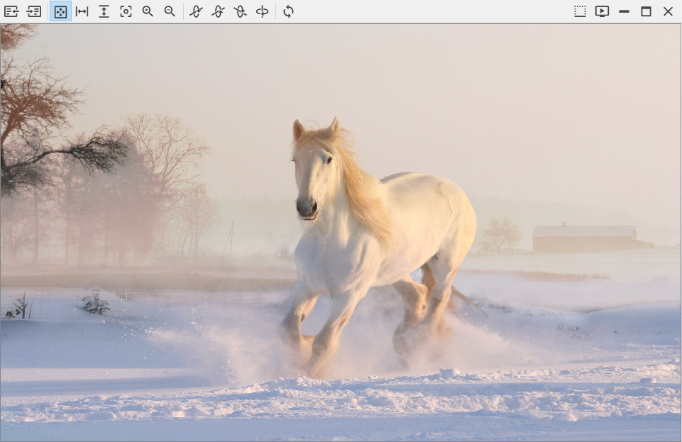
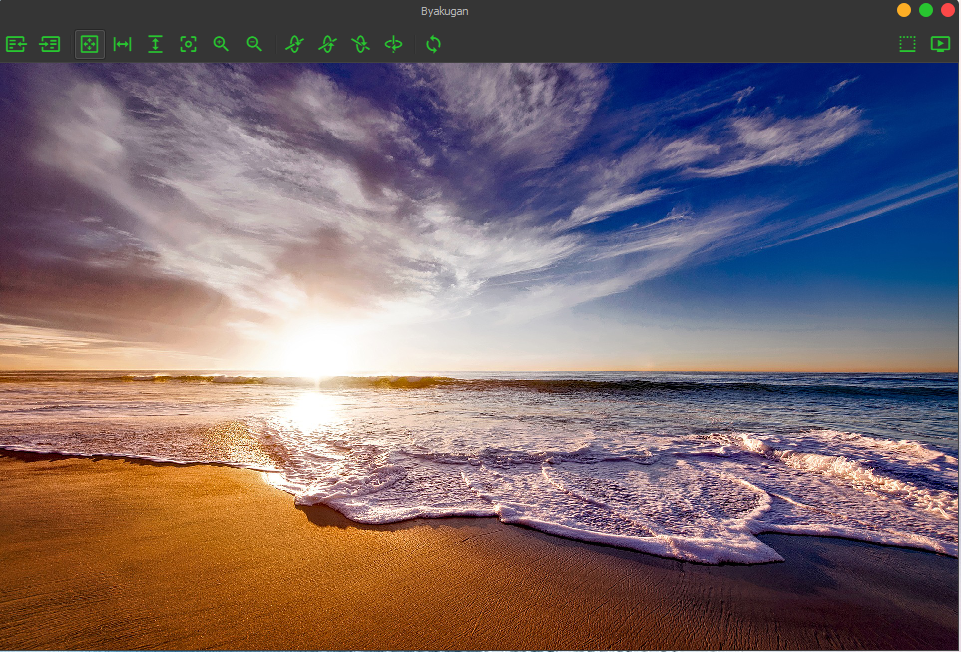

## Byakugan  
Byakugan is a smart image viewer, editor, and organizer which uses the latest 
computer vision technologies to make managing digital photos a 'snap'

## ScreenShots:

###### Image Viewer

  

## Acknowledgements:
- Theme adapted from [qtmodern](https://github.com/gmarull/qtmodern)

## License:

Licensed under the [MIT](LICENSE.txt) license.